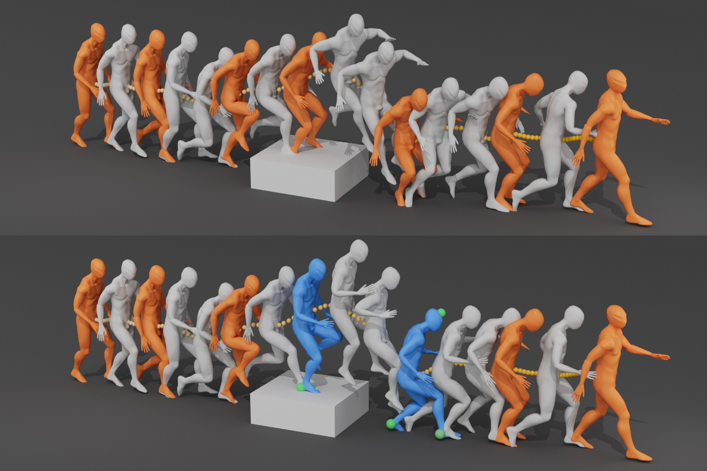

# AutoKeyframe: Autoregressive Keyframe Generation for Human Motion Synthesis and Editing

### [Project Page](https://cr7st.github.io/AutoKeyframe.github.io/) | [Paper (Coming soon)]()

**This repository will contain the official implementation of our SIGGRAPH 2025 paper.**

## 📌 Current Status
⚠️ **Code Release Preparation**  
We are currently finalizing the codebase for public release. The full implementation includes:
- Pretrained models
- Prcessed dataset
- Training and inference code